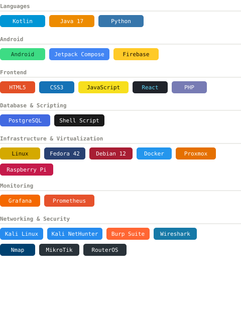

  

# 👾 Alexandre Tognato (Exotermo)
**Backend & Infrastructure Engineer**

## Um pouco de mim 

Meu nome é Alexandre, tenho 18 anos e minha jornada no mundo da tecnologia começou muito cedo. Aos 7 anos, montei meu primeiro computador e desde então nunca parei de aprender. Ao longo do tempo, passei por diversos desafios e experiências, Trabalhei como ajudante de eletricista em obras com meu tio por 3 anos, o que me ensinou a importância de resolver problemas e me adaptar rapidamente.

Com experiência no gerenciamento de servidores e infraestrutura. Além disso, estou sempre expandindo meus conhecimentos e, por isso, estou sempre desenvolvendo pequenos projetos pessoais para aprimorar minha lógica de programação, como jogos e automações práticas em casa.
Meus estudos estão focados em Segurança Ofensiva, Redes e treinamento de IA com a perspectiva de integrar essas áreas com DevOps. Minha paixão é buscar soluções inovadoras e eficientes, sempre com o objetivo de otimizar sistemas e aprender mais a cada dia.

---

## Atuação Profissional

Atualmente atuo como Auxiliar de Desenvolvimento de Sistemas na Pedra Branca Escavações, empresa do setor de escavações para usinas hidrelétricas, com sede em Curitiba – PR.

Meu trabalho envolve desenvolvimento e manutenção de um sistema corporativo completo para rastreabilidade de materiais sensíveis (PCEs – Produtos Controlados pelo Exército), incluindo emulsões e explosivos utilizados em obras de grande porte.

# Backend & Integração

• Desenvolvimento e manutenção de API corporativa  
• Sincronização bidirecional entre servidor central e aplicação Android  
• Controle de regras de negócio críticas (consumo, retorno, perda e auditoria)  
• Integração com ERP (SAP Business One)  
• Automação de rotinas internas utilizando Python  
• Deploy e versionamento de aplicações  
• Monitoramento e suporte a servidores Linux  

# Desenvolvimento Android (Kotlin)

• Aplicativo corporativo para scanner industrial Zebra  
• Integração direta com API interna do sensor de captura  
• Processamento em tempo real de leitura de código de barras  
• Validação de fluxo logístico completo  
• Geração automatizada de relatórios em PDF, CSV e TXT  
• Controle de rastreabilidade ponta a ponta  

O sistema é utilizado em ambiente operacional real, onde confiabilidade, precisão e rastreabilidade são requisitos obrigatórios.

---

  

---

# Filosofia de Engenharia

> "A simplicidade é o último grau de sofisticação"
>
> Frase que levo comigo em cada projeto que faço. Entendo que a sofisticação necessária é aquela que atinge a confiabilidade do software em cada etapa do fluxo definido, que seja, entretudo, funcional, agradável e alinhada ao objetivo final, além de escalável e confiável.
> Ou seja, simplicidade não é ausência de sofisticação; é complexidade bem resolvida na estrutura.
> Essa é a minha filosofia de execução.

---

  E se ninguém vai ser do bem, Bom, tentemos ser menos maus 

